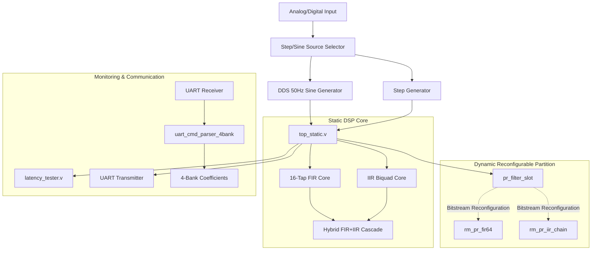

# Ultra-Low Latency Runtime-Reconfigurable FIR/IIR DSP Architecture Using FPGA Partial Reconfiguration

This repository implements a high-performance, ultra-low latency runtime-reconfigurable Digital Signal Processing (DSP) architecture on FPGA. Using AMD/Xilinx Vivado and hardware-level Partial Reconfiguration, this design allows dynamic switching between multiple filter modes (Bypass, FIR, IIR, and Hybrid Cascades) and live reconfiguration of physical DSP slots with minimal hardware downtime.

## Key Features

- **Multi-Mode DSP Engine**: Dynamic runtime switching between:
  - **Bypass Mode**: Direct input-to-output feedthrough.
  - **FIR Core**: 16-tap high-speed FIR filter.
  - **IIR Core**: Second-order Direct Form II Biquad filter.
  - **Hybrid Core**: Cascade execution (FIR filter output fed directly into IIR filter).
- **Runtime Coefficient Switching**:
  - Independent 4-bank memory for FIR and IIR coefficients.
  - Switchable via hardware switches or dynamic command parser via UART.
- **Partial Reconfiguration (PR) Slot**:
  - A physical reconfigurable partition (`pr_filter_slot`) configured to dynamically host different DSP architectures on-the-fly (e.g., swapping between a 64-tap FIR filter `rm_pr_fir64` and a cascaded IIR filter chain `rm_pr_iir_chain`).
- **Real-Time Latency Benchmarking**:
  - Integrated hardware latency tester (`latency_tester.v`) that tracks clock cycles for filtering latency, static switch latency, PR load latency, and total latency.
  - Latency statistics are automatically reported back via framed UART messages.
- **UART Communication System**:
  - Streams filtered sample outputs framed as `AA 55 LSB MSB`.
  - Transmits system performance stats framed as `EE FF [4x32-bit metrics] 55 AA`.

---

## Repository Structure

```
├── fir_iir_23_03_2026.xpr       # Vivado Project File
├── fir_iir_23_03_2026.srcs      # Source files directory
│   ├── sources_1/new            # Verilog source code modules
│   │   ├── top_static.v         # Static top-level wrapper
│   │   ├── pr_filter_slot.v     # Reconfigurable partition interface wrapper
│   │   ├── rm_pr_fir64.v        # Reconfigurable Module: 64-tap FIR filter
│   │   ├── rm_pr_iir_chain.v    # Reconfigurable Module: Cascaded IIR chain
│   │   ├── biquad_core.v        # IIR Biquad filter logic
│   │   ├── fir16_core.v         # 16-tap FIR filter logic
│   │   ├── latency_tester.v     # Real-time latency measurement engine
│   │   ├── dds_sine_50hz.v      # Sine wave generator for hardware testing
│   │   ├── sin_lut256.v         # Sine Look-up Table
│   │   ├── uart_tx.v            # High-speed UART Transmitter
│   │   ├── UART RX.v            # High-speed UART Receiver
│   │   └── uart_cmd_parser_4bank.v # Dynamic command and coefficient parser
│   └── utils_1                  # Vivado design checkpoint/run utilities
├── *.tcl                        # Automating scripts for Vivado runs & PR
│   ├── update_project.tcl       # Project sync/update script
│   ├── force_rebuild.tcl        # Forces regeneration of runs
│   ├── fix_runs.tcl             # Normalizes Vivado runs
│   ├── clean_pblock.tcl         # Pblock boundaries reset
│   ├── fix_pblock.tcl           # PR Pblock setup constraints
│   └── move_pblock.tcl          # Pblock placement scripts
└── .gitignore                   # Vivado project ignore patterns
```

---

## Architecture Overview



---

## How to Use the Project

### Prerequisites
- **Xilinx Vivado Design Suite** (2020.2 or later recommended).
- Hardware development board supporting Partial Reconfiguration (e.g., Artix-7, Kintex-7, or Zynq-7000).

### Opening in Vivado
1. Launch AMD/Xilinx Vivado.
2. Go to **File -> Open Project** and choose `fir_iir_23_03_2026.xpr`.
3. In the Vivado Tcl Console, you can run any of the automated scripts, e.g., to clean or configure runs:
   ```tcl
   source update_project.tcl
   ```

### Managing Reconfiguration Pblocks
To configure and establish the reconfigurable boundary constraints for the partial reconfiguration slot:
```tcl
source fix_pblock.tcl
```

---

## License

This project is open-source and available under the MIT License.
